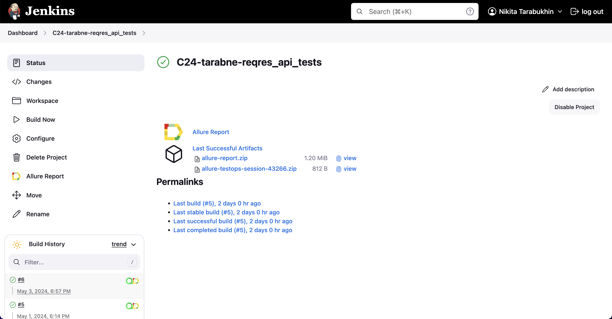
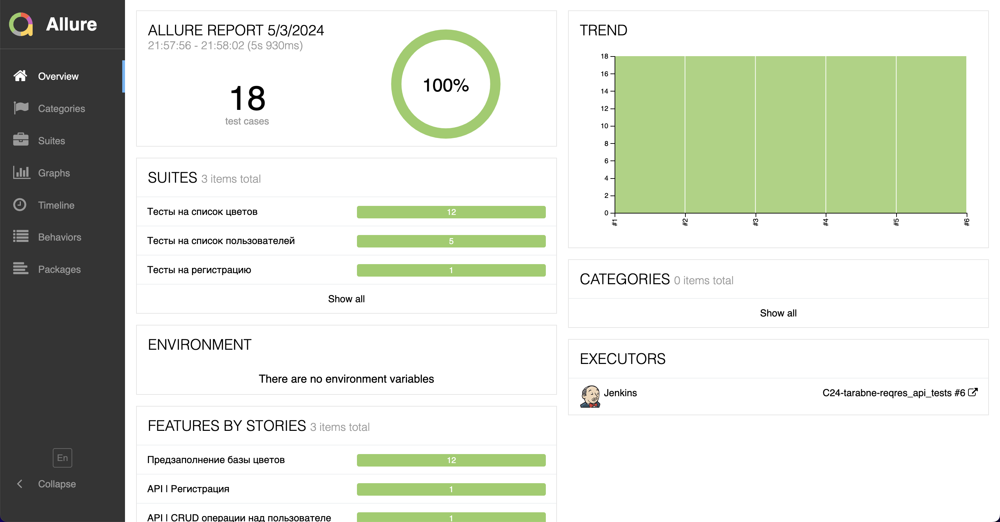
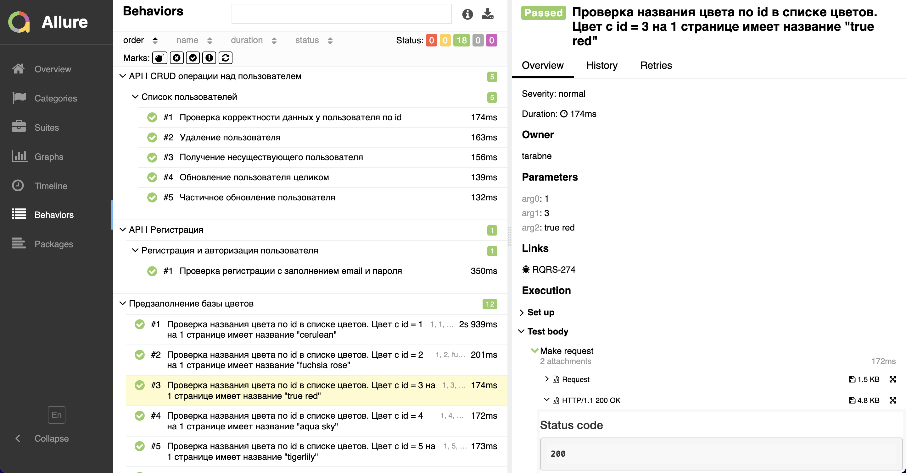
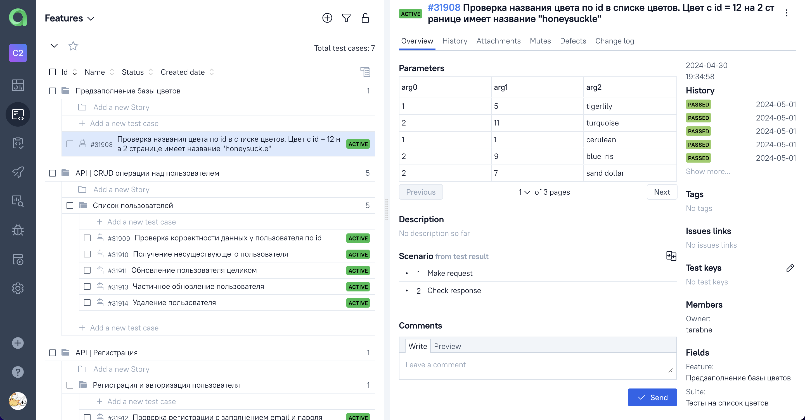
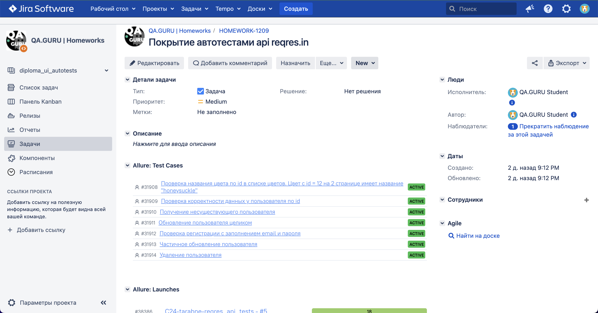
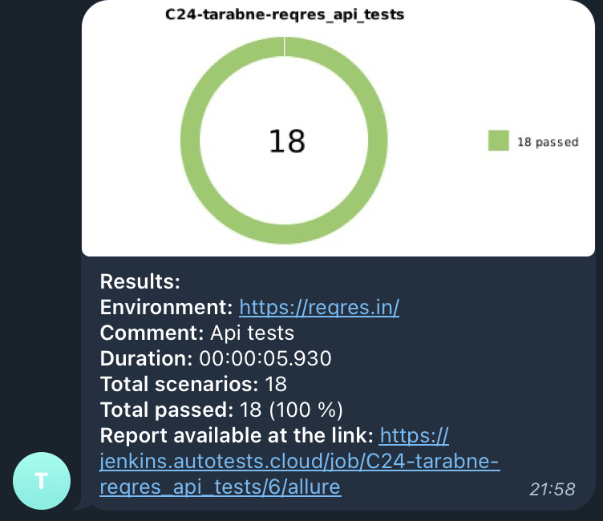

# Проект по автоматизации тестирования API для сайта [Reqres](https://reqres.in/)
<p align="center"><a href="https://reqres.in/"></a></p>

> Reqres - сервис, предоставляющий публичный API для практики тестирования и разработки

## Содержание:

- [Технологии и инструменты](#tools)
- [Тестовое покрытие](#cases)
- [Локальный запуск тестов](#localrun)
- [Запуск тестов в Jenkins](#remoterun)
- [Allure отчёт](#report)
- [Интеграция с Allure TestOps](#testops)
- [Интеграция с Jira](#jira)
- [Уведомления в Telegram](#telegram)


<a id="tools"></a>

## Технологии и инструменты:

<div align="center">
<a href="https://www.jetbrains.com/idea/"></a>
<a href="https://github.com/"></a>  
<a href="https://www.java.com/"></a>
<a href="https://gradle.org/"></a>  
<a href="https://junit.org/junit5/"></a>
<a href="https://rest-assured.io/"></a>
<a href="https://www.jenkins.io/"></a>
<a href="https://github.com/allure-framework/"></a>
<a href="https://qameta.io/"></a>
<a href="https://www.atlassian.com/software/jira"></a>  
<a href="https://telegram.org/"></a>
</div>

<p></p>

Автотесты для данного проекта написаны на <code>Java</code> с использованием библиотеки <code>REST-assured</code> для взаимодействия с REST api.

В качестве фреймворка для запуска тестов используется <code>Junit5</code>, а в качестве сборщика проекта - <code>Gradle</code>. Произведена настройка CI в <code>Jenkins</code>.

По результатам каждого тестового прогона создаётся <code>Allure</code> отчёт для визуализации результатов прогона.

Для тест-менеджмента настроена интеграция с <code>Allure TestOps</code>, которая, в свою очередь, интегрирована с таск-трекером <code>Jira</code>

После прогона тестов <code>Telegram</code> бот присылает сообщение с информацией о прошедшем прогоне

<a id="cases"></a>

## Тестовое покрытие:
### Регистрация пользователя
🐞 Проверка регистрации с заполнением email и пароля

### Список пользователей
🐞 Проверка корректности данных у пользователя по id

🐞 Удаление пользователя

🐞 Получение несуществующего пользователя

🐞 Обновление пользователя целиком

🐞 Частичное обновление пользователя

### Список цветов
🐞 Проверка названия цвета по id в списке цветов (это параметризованный тест, в тесте проверяется соответствие id цвета его названию для каждого цвета из базы)

<a id="localrun"></a>

## Локальный запуск тестов
Для локального запуска тестов из IDE или из терминала необходимо выполнить следующую команду

```
gradle clean test
```

<a id="remoterun"></a>

## Запуск тестов в [Jenkins](https://jenkins.autotests.cloud/job/C24-tarabne-reqres_api_tests/)
Для запуска тестов в Jenkins нужно нажать на кнопку Build Now в соответствующей сборке

<p align="center">

</p>

<a id="report"></a>

## [Allure отчёт](https://jenkins.autotests.cloud/job/C24-tarabne-reqres_api_tests/allure/)
### Графики

<p align="center">

</p>

### Тесты

<p align="center">

</p>

<a id="testops"></a>

## Интеграция с [Allure TestOps](https://allure.autotests.cloud/project/4207/test-cases)

<p align="center">

</p>

<a id="jira"></a>

## Интеграция с [Jira](https://jira.autotests.cloud/browse/HOMEWORK-1209)

<p align="center">

</p>

<a id="telegram"></a>

## Уведомление в Telegram

По результатам каждого прогона тестов в Jenkins отправляется сообщение в Telegram. Сообщение содержит информацию о прогоне, а также диаграмму со статистикой прохождения тестов.

<p align="center">

</p>
